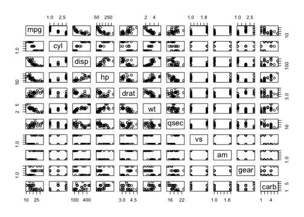
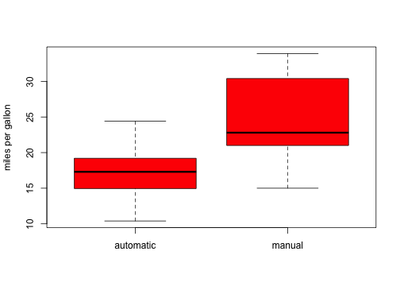
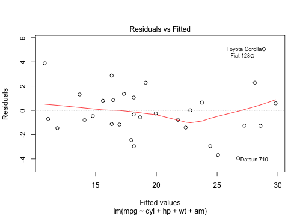
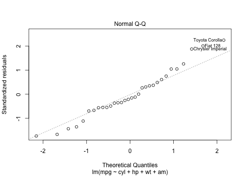
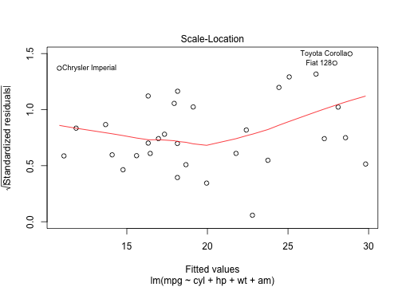
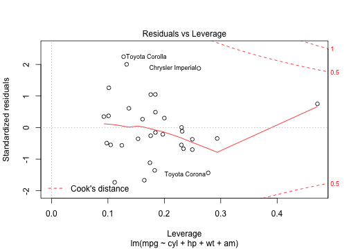
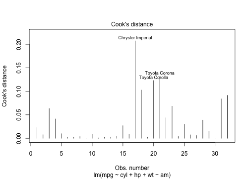
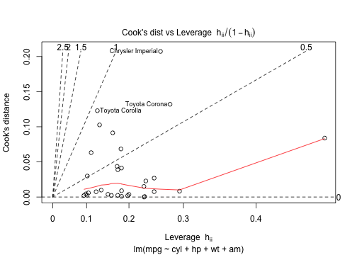

## Transmission Effects For Efficient Fuel Usage In Cars

### Executive Summary
In this report, we have the effects of manual or automatic transmission for efficient fuel usage in cars. The data we have used comes from the 1974 edition of our Motor Trend Magazine. We have predicted that the weight of the car was a significant confounder in our analysis, and the choice of manual or automatic depends on it.

### Initial Data and Pre-Processing
We transform all relevant variables to their corresponding factors and the transmission (am) data to its actual value (0 = automatic, 1 = manual)

<pre class="knitr r">mtcars$cyl <- factor(mtcars$cyl)
mtcars$gear <- factor(mtcars$gear)
mtcars$vs <- factor(mtcars$vs)
mtcars$carb <- factor(mtcars$carb)
mtcars$am[mtcars$am =="0"] <- "automatic"
mtcars$am[mtcars$am =="1"] <- "manual"
mtcars$am <- as.factor(mtcars$am)
str(mtcars)
</pre>

### Exploratory Data Analysis
From the exploratory analysis (Figure 1, Appendix)  done through scatterplot of all the variables in the dataset we can observe that there is a significant correlation between mpg and the other variables of interest like cyl, disp, hp, draft, wt, vs and am. Note that we are also interested in exploring the relation between the mpg and its effects of car transmission type, we explore from box-and-whisker plot that there is a steady increase in mpg when the transmission for the car used is manual.

### Regression Analysis
We build several linear regression models based on factorized variables we preprocessed in the processing step above and try to find out the best model and compare it with the base model using anova. After model selection, we also perform analysis of residuals.

#### Best Regression Model
In order to choose the best model, we use the stepwise selection (forward, backward, both) using the stepAIC( ) function from the MASS package.

<pre class="knitr r">library(MASS)
fit <- lm(mpg~.,data=mtcars)
bestmodel <- stepAIC(fit, direction="both")
</pre>

The following code chunk shows the best regression model that is obtained by the interactions of several variables. The best model consists of the variables, cyl, wt and hp as confounders and am as the independent variable. As we can see the R-square coefficient of 84% is the value we can obtain by fitting the best model.

<pre class="knitr r"> summary(bestmodel)$r.squared
</pre>

<pre class="knitr r">## [1] 0.8659
</pre>

#### ANOVA - Analysis of variances
We now derive from the anova for different cases involving a. transmission, b. all variables and c. best fit variable combination of predictors cyl, hp, wt and am.

<pre class="knitr r">## Analysis of Variance Table
## 
## Model 1: mpg ~ cyl + disp + hp + drat + wt + qsec + vs + am + gear + carb
## Model 2: mpg ~ am
## Model 3: mpg ~ cyl + hp + wt + am
##   Res.Df RSS  Df Sum of Sq     F  Pr(>F)    
## 1     15 120                                
## 2     30 721 -15      -600  4.99  0.0018 ** 
## 3     26 151   4       570 17.75 1.5e-05 ***
## ---
## Signif. codes:  0 '***' 0.001 '**' 0.01 '*' 0.05 '.' 0.1 ' ' 1
</pre>

Note that the smaller values for the p-value in the anova above indicates that the confounding variables cyl, wt and hp are statistically insignificant; and we reject the hypothesis that these variables do not contribute to the accuracy of our model.

#### Residual Analysis
Please see the residual plots for our chosen regression model. We can conclude the following from the plot:
* The points in the Residuals vs Fitted plot are randomly scattered with no particular pattern.
* The points in the Normal Q–Q plot are more-or-less on the line, indicating that the residuals follow a normal distribution.
* In both the Scale–Location plot and the Residuals vs Leverage plots, the points are in a group with none too far from the center.

#### Diagnostics
We want to identify the impact of an observation on the regression coefficients, and one approach is to consider how much the regression coefficient values change if the observation was not considered. 

<pre class="knitr r">leverage<-hatvalues(bestmodel)
head(sort(leverage,decreasing=TRUE),3)
</pre>

<pre class="knitr r">##       Maserati Bora Lincoln Continental       Toyota Corona 
##              0.4714              0.2937              0.2778
</pre>

Please see the appendix section for the cooks distance plot for our chosen regression model. 

From the cooks distance plot above we can confirm our analysis was correct, as the same cars are mentioned in the residual plots.

#### Inference
From the t-test for mpg as the outcome and am as predictor, we clearly see that the manual and automatic transmissions are significatively different.

<pre class="knitr r">t.test(mpg ~ am, data = mtcars)$statistic 
</pre>

<pre class="knitr r">##      t 
## -3.767
</pre>

## Conclusions
From our multiple regression analysis above, we conclude the following:
* The cars with a manual transmission are better for mpg than cars with an automatic transmission. 
* The rate of change of the conditional mean mpg with respect to am is about 1.8, and we are 95% confident that this value varies between -1.06 and 4.68. 
* If we increase the number of cylinders from 4 to 8, mpg will decrease by a factor of 3 concluding a direct relationship.

## Appendix

Scatterplot matrix of mtcars

<pre class="knitr r"> pairs(mpg~ ., data=mtcars)
</pre>

Boxplot of miles per gallon by transmission type

<pre class="knitr r">boxplot(mpg ~ am, data = mtcars, col = "red", ylab = "miles per gallon")
</pre>

Residual plot for our regression model

<pre class="knitr r">plot(bestmodel)
</pre>

Cooks distance plot for regression model

<pre class="knitr r">plot(bestmodel, which=c(4,6))
</pre>

